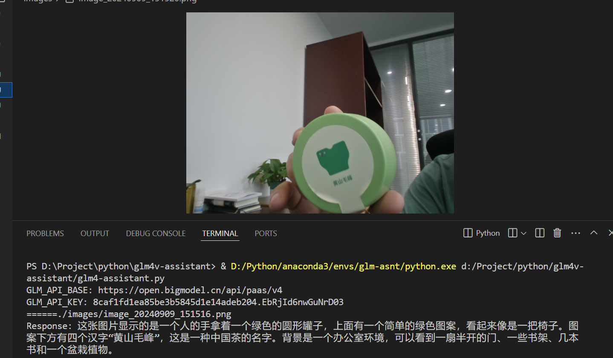

# GLM4V and QWen  ChatTTS AI Demo

You need a `GLM_API_KEY` And `DASHSCOPE_API_KEY` to run this code. Store it in a `.env` file in the root directory of the project, or set them as environment variables.





Create a virtual environment, update pip, and install the required packages:

```
$ git clone https://github.com/gan/glm4v-assistant.git
$ cd glm4v-assistant
$ git clone https://github.com/2noise/ChatTTS.git
```


```
$ conda create -n glm-asnt python=3.10
$ conda activate glm-asnt
```

```
$ conda install -c conda-forge pynini=2.1.5 && pip install WeTextProcessing
$ pip install -U pip
$ pip install -r requirements.txt
```

Run the assistant:

```
$ python3 glm4-assistant.py
```
